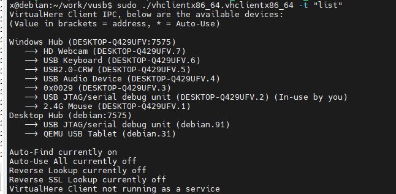

# 远程映射usb设备Virtual Here

*不要用官网的安装方案，官网的方案必须要 license。

1、去官网下载服务端 运行在 usb 设备所在的 系统上。https://www.virtualhere.com/

2、下载 客户端 放在需要使用 usb 设备的系统上。

3、创建启动文件。以linux 为例子：

```bash
// run.sh
nohup ./vhclientx86_64.vhclientx86_64 2>&1 1>/dev/null &
echo $! > pid

// stop.sh
kill -9 `cat pid`
```

4、运行run.sh

5、查看设备列表

​`vhclientx86_64 -t "list"`​

​​

6、连接设备

​`vhclientx86_64 -t "use,DESKTOP-Q429UFV.2"`​

完成
